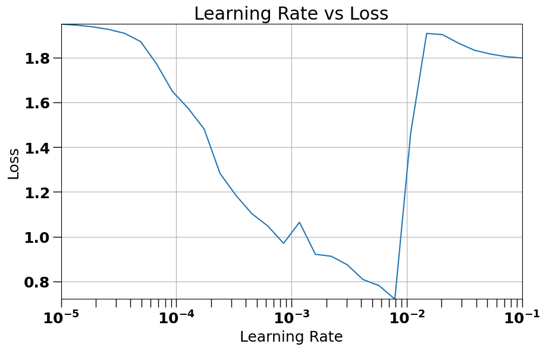
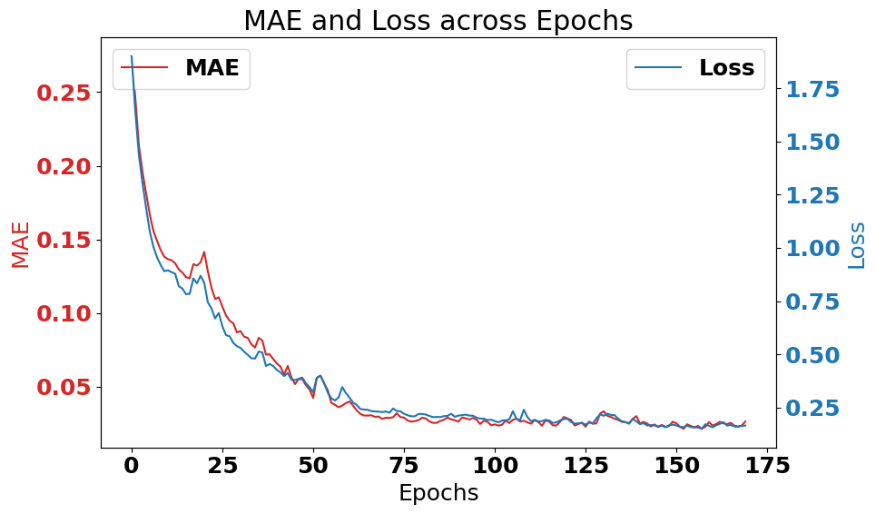
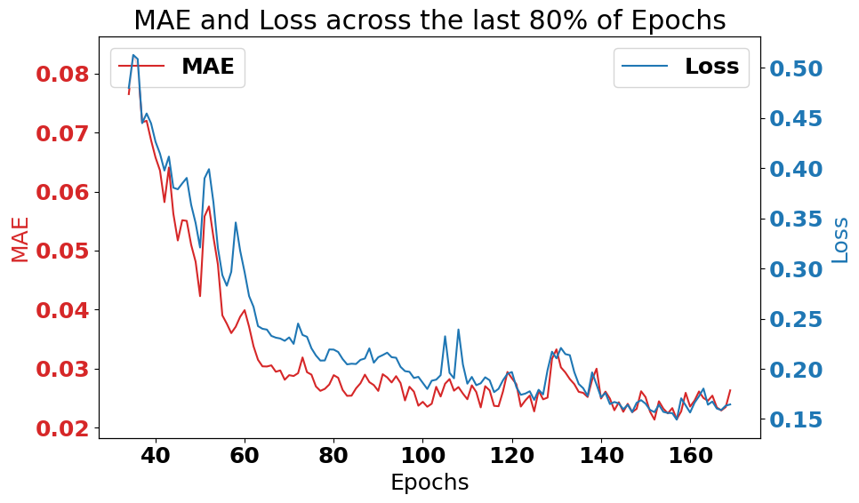
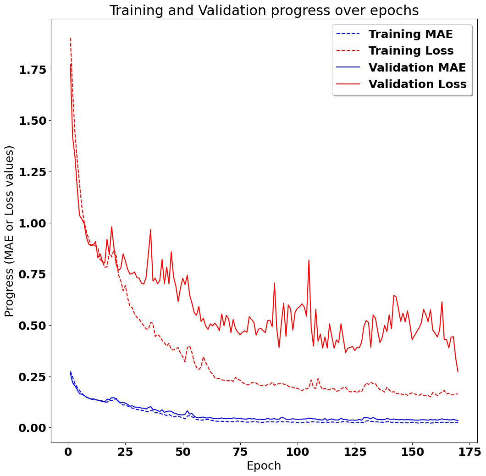
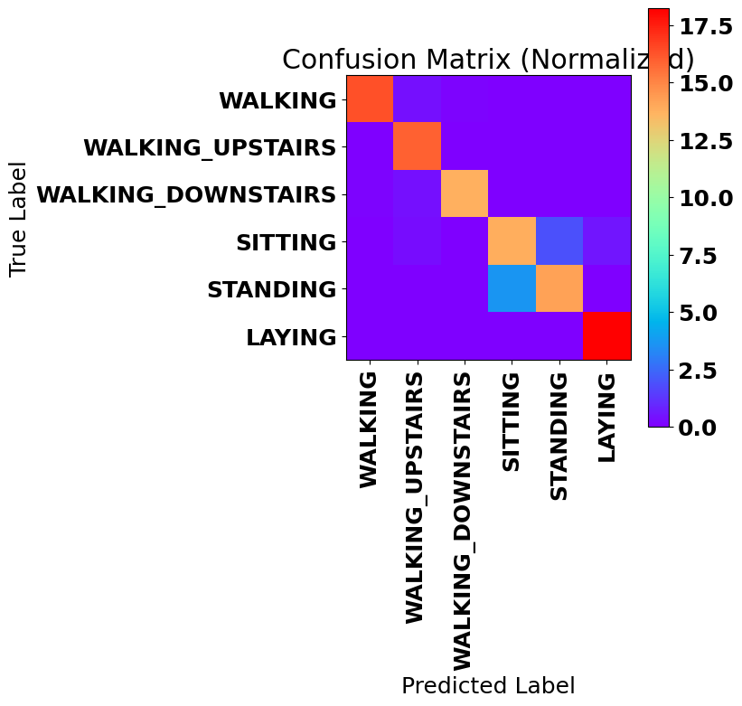

## Introduction:
This work expands upon the efforts of Guillaume Chevalier:
> Guillaume Chevalier, LSTMs for Human Activity Recognition, 2016,
> https://github.com/guillaume-chevalier/LSTM-Human-Activity-Recognition

Guillaume used a TensorFlow version 1.x model that achieved 91% accuracy to classify motion data. In this notebook I have reused code from their introduction and data wrangling efforts, before defining my own CNN-DNN model with TensorFlow version 2. Sections that used Guillaume's code are annotated for clarity.

My model achieved 92.3% accuracy with validation data. Reviewing graphs, you will se that training and validation accuracies remain relatively in sync, which suggests minimal overfitting.


## Setup Environment for Running in Google Colab
This step is done because some local environments may not have a GPU, and so running this notebook in colab allows users to mount a T4 GPU cheaply in order to speed up the training process


```python
import os

try:
    from google.colab import drive

    # Mount Google Drive
    drive.mount('/content/drive')

    # Change to what you expect to be the notebook's directory
    # based on your common directory structure
    GITHUB_FOLDER_PATH = '/content/drive/My Drive/Colab_Notebooks/github/'
    REPO_NAME = 'LSTM-Human-Activity-Recognition'
    os.chdir(os.path.join(GITHUB_FOLDER_PATH, REPO_NAME))
    print(f"Changed directory to {os.getcwd()}")

except ImportError:
    # Local environment (like running in VS Code)
    notebook_path = os.getcwd()
    print(f"Running on local machine, current directory is {notebook_path}")
```

    Drive already mounted at /content/drive; to attempt to forcibly remount, call drive.mount("/content/drive", force_remount=True).
    Changed directory to /content/drive/My Drive/Colab_Notebooks/github/LSTM-Human-Activity-Recognition


### (Authored by Guillaume Chevalier)
# <a title="Activity Recognition" href="https://github.com/guillaume-chevalier/LSTM-Human-Activity-Recognition" > LSTMs for Human Activity Recognition</a>

Human Activity Recognition (HAR) using smartphones dataset and an LSTM RNN. Classifying the type of movement amongst six categories:
- WALKING,
- WALKING_UPSTAIRS,
- WALKING_DOWNSTAIRS,
- SITTING,
- STANDING,
- LAYING.

Compared to a classical approach, using a Recurrent Neural Networks (RNN) with Long Short-Term Memory cells (LSTMs) require no or almost no feature engineering. Data can be fed directly into the neural network who acts like a black box, modeling the problem correctly. [Other research](https://archive.ics.uci.edu/ml/machine-learning-databases/00240/UCI%20HAR%20Dataset.names) on the activity recognition dataset can use a big amount of feature engineering, which is rather a signal processing approach combined with classical data science techniques. The approach here is rather very simple in terms of how much was the data preprocessed.

Let's use Google's neat Deep Learning library, TensorFlow, demonstrating the usage of an LSTM, a type of Artificial Neural Network that can process sequential data / time series.

## Video dataset overview

Follow this link to see a video of the 6 activities recorded in the experiment with one of the participants:

<p align="center">
  <a href="http://www.youtube.com/watch?feature=player_embedded&v=XOEN9W05_4A
" target="_blank"></a>
  <a href="https://youtu.be/XOEN9W05_4A"><center>[Watch video]</center></a>
</p>

## Details about the input data

I will be using an LSTM on the data to learn (as a cellphone attached on the waist) to recognise the type of activity that the user is doing. The dataset's description goes like this:

> The sensor signals (accelerometer and gyroscope) were pre-processed by applying noise filters and then sampled in fixed-width sliding windows of 2.56 sec and 50% overlap (128 readings/window). The sensor acceleration signal, which has gravitational and body motion components, was separated using a Butterworth low-pass filter into body acceleration and gravity. The gravitational force is assumed to have only low frequency components, therefore a filter with 0.3 Hz cutoff frequency was used.

That said, I will use the almost raw data: only the gravity effect has been filtered out of the accelerometer  as a preprocessing step for another 3D feature as an input to help learning. If you'd ever want to extract the gravity by yourself, you could fork my code on using a [Butterworth Low-Pass Filter (LPF) in Python](https://github.com/guillaume-chevalier/filtering-stft-and-laplace-transform) and edit it to have the right cutoff frequency of 0.3 Hz which is a good frequency for activity recognition from body sensors.

## What is an RNN?

As explained in [this article](http://karpathy.github.io/2015/05/21/rnn-effectiveness/), an RNN takes many input vectors to process them and output other vectors. It can be roughly pictured like in the image below, imagining each rectangle has a vectorial depth and other special hidden quirks in the image below. **In our case, the "many to one" architecture is used**: we accept time series of [feature vectors](https://www.quora.com/What-do-samples-features-time-steps-mean-in-LSTM/answer/Guillaume-Chevalier-2) (one vector per [time step](https://www.quora.com/What-do-samples-features-time-steps-mean-in-LSTM/answer/Guillaume-Chevalier-2)) to convert them to a probability vector at the output for classification. Note that a "one to one" architecture would be a standard feedforward neural network.

> <a href="https://www.dl-rnn-course.neuraxio.com/start?utm_source=github_lstm" ></a>
> [Learn more on RNNs](https://www.dl-rnn-course.neuraxio.com/start?utm_source=github_lstm)

## What is an LSTM?

An LSTM is an improved RNN. It is more complex, but easier to train, avoiding what is called the vanishing gradient problem. I recommend [this course](https://www.dl-rnn-course.neuraxio.com/start?utm_source=github_lstm) for you to learn more on LSTMs.

> [Learn more on LSTMs](https://www.dl-rnn-course.neuraxio.com/start?utm_source=github_lstm)


### (Authored by Nick Van Nest)
## Import Packages


```python
# Standard library imports
import os
import sys

# Third-party library imports
import matplotlib.pyplot as plt
import numpy as np
from sklearn import metrics
from sklearn.metrics import accuracy_score, confusion_matrix, f1_score, precision_score, recall_score
import tensorflow as tf

# Installing scikit-learn package
!{sys.executable} -m pip install scikit_learn

# TensorFlow and Keras imports
from tensorflow.keras import regularizers
from tensorflow.keras.models import Model

```

    Requirement already satisfied: scikit_learn in /usr/local/lib/python3.10/dist-packages (1.2.2)
    Requirement already satisfied: numpy>=1.17.3 in /usr/local/lib/python3.10/dist-packages (from scikit_learn) (1.23.5)
    Requirement already satisfied: scipy>=1.3.2 in /usr/local/lib/python3.10/dist-packages (from scikit_learn) (1.11.2)
    Requirement already satisfied: joblib>=1.1.1 in /usr/local/lib/python3.10/dist-packages (from scikit_learn) (1.3.2)
    Requirement already satisfied: threadpoolctl>=2.0.0 in /usr/local/lib/python3.10/dist-packages (from scikit_learn) (3.2.0)


### (Modified work taken from Guillaume Chevalier)
## Define Constants to Describe Input Data Features and Labels


```python
# Those are separate normalised input features for the neural network
INPUT_SIGNAL_TYPES = [
    "body_acc_x_",
    "body_acc_y_",
    "body_acc_z_",
    "body_gyro_x_",
    "body_gyro_y_",
    "body_gyro_z_",
    "total_acc_x_",
    "total_acc_y_",
    "total_acc_z_"
]

# Output classes to learn how to classify
LABELS = [
    "WALKING",
    "WALKING_UPSTAIRS",
    "WALKING_DOWNSTAIRS",
    "SITTING",
    "STANDING",
    "LAYING"
]
```

### (Modified work taken from Guillaume Chevalier)
## Let's start by downloading the data:


```python
DATA_PATH = "data/"

!pwd && ls
os.chdir(DATA_PATH)
!pwd && ls

!python download_dataset.py

!pwd && ls
os.chdir("..")
!pwd && ls

DATASET_PATH = DATA_PATH + "UCI HAR Dataset/"
print("\n" + "Dataset is now located at: " + DATASET_PATH)

```

    /content/drive/MyDrive/Colab_Notebooks/github/LSTM-Human-Activity-Recognition
    data		LSTM_original.ipynb
    LICENSE		mae_and_loss_last_80_percent_model1.png
    LSTM_files	mae_and_loss_model1.png
    LSTM_new_files	README.md
    LSTM_new.ipynb	training_validation_metrics_model1.png
    /content/drive/MyDrive/Colab_Notebooks/github/LSTM-Human-Activity-Recognition/data
     download_dataset.py   source.txt	 'UCI HAR Dataset.zip'
     __MACOSX	      'UCI HAR Dataset'
    
    Downloading...
    Dataset already downloaded. Did not download twice.
    
    Extracting...
    Dataset already extracted. Did not extract twice.
    
    /content/drive/MyDrive/Colab_Notebooks/github/LSTM-Human-Activity-Recognition/data
     download_dataset.py   source.txt	 'UCI HAR Dataset.zip'
     __MACOSX	      'UCI HAR Dataset'
    /content/drive/MyDrive/Colab_Notebooks/github/LSTM-Human-Activity-Recognition
    data		LSTM_original.ipynb
    LICENSE		mae_and_loss_last_80_percent_model1.png
    LSTM_files	mae_and_loss_model1.png
    LSTM_new_files	README.md
    LSTM_new.ipynb	training_validation_metrics_model1.png
    
    Dataset is now located at: data/UCI HAR Dataset/


### (Modified work taken from Guillaume Chevalier)
## Preparing dataset:


```python
# Load "X" (the neural network's training and testing inputs)
def load_X(X_signals_paths):
    X_signals = []

    for signal_type_path in X_signals_paths:
        file = open(signal_type_path, 'r')
        # Read dataset from disk, dealing with text files' syntax
        X_signals.append(
            [np.array(serie, dtype=np.float32) for serie in [
                row.replace('  ', ' ').strip().split(' ') for row in file
            ]]
        )
        file.close()

    return np.transpose(np.array(X_signals), (1, 2, 0))

def load_y(y_path):
    file = open(y_path, 'r')
    # Read dataset from disk, dealing with text file's syntax
    y_ = np.array(
        [elem for elem in [
            row.replace('  ', ' ').strip().split(' ') for row in file
        ]],
        dtype=np.int32
    )
    file.close()

    # Substract 1 to each output class for friendly 0-based indexing
    return y_ - 1

TRAIN = "train/"
TEST = "test/"

X_train_signals_paths = [
    DATASET_PATH + TRAIN + "Inertial Signals/" + signal + "train.txt" for signal in INPUT_SIGNAL_TYPES
]
X_test_signals_paths = [
    DATASET_PATH + TEST + "Inertial Signals/" + signal + "test.txt" for signal in INPUT_SIGNAL_TYPES
]

X_train = load_X(X_train_signals_paths)
X_test = load_X(X_test_signals_paths)


# Load "y" (the neural network's training and testing outputs)

y_train_path = DATASET_PATH + TRAIN + "y_train.txt"
y_test_path = DATASET_PATH + TEST + "y_test.txt"

y_train = load_y(y_train_path)
y_test = load_y(y_test_path)

```

### (The code below was authored by Nick Van Nest)
## Define Utility Functions


```python
import tensorflow as tf

def one_hot(y_, n_classes):
    # This function was taken with modification from Guillaume Chevalier)
    # Function to encode neural one-hot output labels from number indexes
    # e.g.:
    # one_hot(y_=[[5], [0], [3]], n_classes=6):
    #     return [[0, 0, 0, 0, 0, 1], [1, 0, 0, 0, 0, 0], [0, 0, 0, 1, 0, 0]]

    y_ = y_.reshape(len(y_))
    return np.eye(n_classes)[np.array(y_, dtype=np.int32)]  # Returns FLOATS

def prepare_dataset(features, labels, batch_size, shuffle_buffer_size=1000):
    """
    Prepare a shuffled and batched tf.data.Dataset given features and labels.

    Args:
    - features (ndarray): The feature data; shape should be (num_samples, 128, 9).
    - labels (ndarray): The label data; shape should be (num_samples, 5).
    - batch_size (int): Size of each batch.
    - shuffle_buffer_size (int): Size of shuffle buffer.

    Returns:
    - dataset (tf.data.Dataset): Shuffled and batched dataset.
    """

    # Create a tf.data.Dataset object from the features and labels
    dataset = tf.data.Dataset.from_tensor_slices((features, labels))

    # Shuffle the dataset
    dataset = dataset.shuffle(shuffle_buffer_size)

    # Batch the data
    dataset = dataset.batch(batch_size)

    # Using prefetch to improve performance
    dataset = dataset.prefetch(1)

    return dataset

def plot_lr_vs_loss(epochs, lr_loss_logger):
    # Use learning rates logged by custom logger
    lrs = lr_loss_logger.learning_rates

    # Use losses logged by custom logger
    losses = lr_loss_logger.losses

    # Plotting
    plt.figure(figsize=(10, 6))
    plt.grid(True)
    plt.semilogx(lrs, losses)
    plt.tick_params('both', length=10, width=1, which='both')
    plt.axis([min(lrs), max(lrs), min(losses), max(losses)])
    plt.xlabel('Learning Rate')
    plt.ylabel('Loss')
    plt.title('Learning Rate vs Loss')
    plt.show()

    return #np.array([lrs, losses]).T

def plot_series_dual_y(x, y1, y2, title=None, xlabel=None, ylabel1=None, ylabel2=None, legend1=None, legend2=None, filename=None):
    fig, ax1 = plt.subplots(figsize=(10, 6))

    color = 'tab:red'
    ax1.set_xlabel(xlabel)
    ax1.set_ylabel(ylabel1, color=color)
    ax1.plot(x, y1, color=color)
    ax1.tick_params(axis='y', labelcolor=color)

    ax2 = ax1.twinx()
    color = 'tab:blue'
    ax2.set_ylabel(ylabel2, color=color)
    ax2.plot(x, y2, color=color)
    ax2.tick_params(axis='y', labelcolor=color)

    if legend1 or legend2:
        ax1.legend([legend1], loc='upper left')
        ax2.legend([legend2], loc='upper right')

    plt.title(title)
    fig.tight_layout()
    if filename:
        plt.savefig(filename)
    plt.show()

def plot_training_validation_metrics(history, title, filename=None):
    # Inline plots
    %matplotlib inline

    # Font settings
    font = {
        'weight': 'bold',
        'size': 18
    }
    plt.rc('font', **font)

    # Figure size
    plt.figure(figsize=(12, 12))

    # Extract training and validation metrics from history object
    train_mae = history.history['mae']
    train_loss = history.history['loss']
    val_mae = history.history['val_mae']
    val_loss = history.history['val_loss']

    # Create epoch axis and plot training metrics
    epochs = range(1, len(train_mae) + 1)
    plt.plot(epochs, train_mae, 'b--', label='Training MAE')
    plt.plot(epochs, train_loss, 'r--', label='Training Loss')

    # Plot validation metrics
    plt.plot(epochs, val_mae, 'b-', label='Validation MAE')
    plt.plot(epochs, val_loss, 'r-', label='Validation Loss')

    # Labels and title
    plt.title(title)
    plt.legend(loc='upper right', shadow=True)
    plt.ylabel('Progress (MAE or Loss values)')
    plt.xlabel('Epoch')

    # Save the plot if filename is provided
    if filename:
        plt.savefig(filename)

    # Show the plot
    plt.show()

def print_classification_metrics(X, y_true_oh, model, average_method="weighted"):
    # Make predictions on the original ordered data
    predictions_prob = model.predict(X)
    predictions = np.argmax(predictions_prob, axis=1)

    # Converting one-hot encoded y_test to label encoded
    true_labels = np.argmax(y_true_oh, axis=1)

    # Calculating metrics
    accuracy = accuracy_score(true_labels, predictions)
    precision = precision_score(true_labels, predictions, average=average_method)
    recall = recall_score(true_labels, predictions, average=average_method)
    f1 = f1_score(true_labels, predictions, average=average_method)

    print(f"Testing Accuracy: {accuracy * 100}%")
    print(f"Precision: {precision * 100}%")
    print(f"Recall: {recall * 100}%")
    print(f"F1 Score: {f1 * 100}%")

def plot_normalized_confusion_matrix(X, y_true_oh, model, labels, cmap=plt.cm.rainbow):
    # Make predictions on the original ordered data
    predictions_prob = model.predict(X)
    predictions = np.argmax(predictions_prob, axis=1)

    # Converting one-hot encoded y_test to label encoded
    true_labels = np.argmax(y_true_oh, axis=1)

    # Generate confusion matrix
    confusion_mtx = confusion_matrix(true_labels, predictions)
    normalised_confusion_matrix = np.array(confusion_mtx, dtype=np.float32)/np.sum(confusion_mtx)*100

    # Create a plot
    plt.figure(figsize=(8, 8))
    plt.imshow(normalised_confusion_matrix, interpolation='nearest', cmap=cmap)
    plt.title("Confusion Matrix (Normalized)")
    plt.colorbar()

    tick_marks = np.arange(len(labels))
    plt.xticks(tick_marks, labels, rotation=90)
    plt.yticks(tick_marks, labels)

    plt.tight_layout()
    plt.ylabel('True Label')
    plt.xlabel('Predicted Label')
    plt.show()
```

## Define Callback Functions to Modify Training


```python
def lr_scheduler(epoch, lr, initial_lr=1e-6, final_lr=1e-2, epochs=10):
    factor = (final_lr / initial_lr) ** (1 / (epochs - 1))
    return initial_lr * (factor ** epoch)

class LearningRateLossLogger(tf.keras.callbacks.Callback):
    def __init__(self):
        super().__init__()
        self.learning_rates = []
        self.losses = []

    def on_epoch_end(self, epoch, logs=None):
        lr = float(tf.keras.backend.get_value(self.model.optimizer.lr))
        self.learning_rates.append(lr)
        self.losses.append(logs['loss'])

class StopAtThresholdCallback(tf.keras.callbacks.Callback):
    def __init__(self, threshold):
        super(StopAtThresholdCallback, self).__init__()
        self.threshold = threshold  # Threshold for stopping the training

    def on_epoch_end(self, epoch, logs=None):
        val_accuracy = logs.get('val_accuracy')
        if val_accuracy is not None and val_accuracy > self.threshold:
            print(f"\nReached {self.threshold * 100}% validation accuracy. Stopping training.")
            self.model.stop_training = True
```


```python
TRAINING_BATCH_SIZE = 512
TESTING_BATCH_SIZE = 32
NUMBER_OF_CLASSES = 6
WINDOW_SIZE = len(X_train[0])
TIME_STEP_PARAMETER_SIZE = len(X_train[0][0])

# Prepare the dataset
y_train_oh = one_hot(y_train, NUMBER_OF_CLASSES)
y_test_oh = one_hot(y_test, NUMBER_OF_CLASSES)
prepared_training = prepare_dataset(X_train, y_train_oh, TRAINING_BATCH_SIZE)
prepared_testing = prepare_dataset(X_test, y_test_oh, TESTING_BATCH_SIZE)

```


```python
# Build the Model
def create_model_v1():
  model = tf.keras.models.Sequential([
    tf.keras.layers.Conv1D(filters=64, kernel_size=3,
                        strides=1,
                        activation="relu",
                        padding='causal',
                        kernel_regularizer=regularizers.l2(0.001),
                        input_shape=[WINDOW_SIZE, TIME_STEP_PARAMETER_SIZE]),
    tf.keras.layers.LSTM(128, return_sequences=True),
    tf.keras.layers.LSTM(128),
    tf.keras.layers.Dense(64, kernel_regularizer=regularizers.l2(0.001), activation="relu"),
    tf.keras.layers.Dropout(0.4),
    tf.keras.layers.Dense(64, kernel_regularizer=regularizers.l2(0.001), activation="relu"),
    tf.keras.layers.Dropout(0.4),
    tf.keras.layers.Dense(NUMBER_OF_CLASSES, activation="softmax"),
  ])
  return model

def create_model_v2():
  # This model is representitive of the original TensorFlow 1.x model, but not exactly the same
  model = tf.keras.models.Sequential([
    tf.keras.layers.LSTM(64, return_sequences=True, input_shape=[WINDOW_SIZE, TIME_STEP_PARAMETER_SIZE], activation='tanh'),
    tf.keras.layers.LSTM(64, activation='tanh'),
    tf.keras.layers.Dense(NUMBER_OF_CLASSES, activation="softmax"),
  ])
  return model

# Print the model summary
model = create_model_v1()
model.summary()
```

    Model: "sequential_1"
    _________________________________________________________________
     Layer (type)                Output Shape              Param #   
    =================================================================
     conv1d_1 (Conv1D)           (None, 128, 64)           1792      
                                                                     
     lstm_2 (LSTM)               (None, 128, 128)          98816     
                                                                     
     lstm_3 (LSTM)               (None, 128)               131584    
                                                                     
     dense_3 (Dense)             (None, 64)                8256      
                                                                     
     dropout_2 (Dropout)         (None, 64)                0         
                                                                     
     dense_4 (Dense)             (None, 64)                4160      
                                                                     
     dropout_3 (Dropout)         (None, 64)                0         
                                                                     
     dense_5 (Dense)             (None, 6)                 390       
                                                                     
    =================================================================
    Total params: 244998 (957.02 KB)
    Trainable params: 244998 (957.02 KB)
    Non-trainable params: 0 (0.00 Byte)
    _________________________________________________________________


## Determine the optimal learning rate for the model


```python
EPOCHS = 30

# Initialize the optimizer
optimizer = tf.keras.optimizers.Adam(learning_rate=1e-8)  # Start with the initial learning rate

# Initialize the Model
model = create_model_v1()

# Compile the model
model.compile(loss=tf.keras.losses.CategoricalCrossentropy(),
              optimizer=optimizer,
              metrics=['accuracy']
              )

# Set the callbacks
lr_loss_logger = LearningRateLossLogger()
scheduler_callback = tf.keras.callbacks.LearningRateScheduler(lambda epoch, lr: lr_scheduler(epoch, lr, initial_lr=1e-5, final_lr=1e-1, epochs=EPOCHS))

# Train the model
history = model.fit(
    prepared_training,
    epochs=EPOCHS,
    callbacks=[scheduler_callback, lr_loss_logger],
    validation_data = prepared_testing
)

# Plot the learning rate versus loss
plot_lr_vs_loss(epochs=EPOCHS, lr_loss_logger=lr_loss_logger)

```

    Epoch 1/30
    15/15 [==============================] - 14s 246ms/step - loss: 1.9495 - accuracy: 0.2259 - val_loss: 1.9459 - val_accuracy: 0.3010 - lr: 1.0000e-05
    Epoch 2/30
    15/15 [==============================] - 2s 117ms/step - loss: 1.9447 - accuracy: 0.2481 - val_loss: 1.9392 - val_accuracy: 0.3227 - lr: 1.3738e-05
    Epoch 3/30
    15/15 [==============================] - 2s 112ms/step - loss: 1.9372 - accuracy: 0.2758 - val_loss: 1.9298 - val_accuracy: 0.3621 - lr: 1.8874e-05
    Epoch 4/30
    15/15 [==============================] - 2s 145ms/step - loss: 1.9257 - accuracy: 0.3058 - val_loss: 1.9156 - val_accuracy: 0.3821 - lr: 2.5929e-05
    Epoch 5/30
    15/15 [==============================] - 2s 162ms/step - loss: 1.9082 - accuracy: 0.3230 - val_loss: 1.8906 - val_accuracy: 0.3651 - lr: 3.5622e-05
    Epoch 6/30
    15/15 [==============================] - 2s 147ms/step - loss: 1.8717 - accuracy: 0.3384 - val_loss: 1.8298 - val_accuracy: 0.3634 - lr: 4.8939e-05
    Epoch 7/30
    15/15 [==============================] - 2s 152ms/step - loss: 1.7728 - accuracy: 0.3456 - val_loss: 1.6665 - val_accuracy: 0.3899 - lr: 6.7234e-05
    Epoch 8/30
    15/15 [==============================] - 2s 144ms/step - loss: 1.6495 - accuracy: 0.3502 - val_loss: 1.5955 - val_accuracy: 0.3359 - lr: 9.2367e-05
    Epoch 9/30
    15/15 [==============================] - 1s 84ms/step - loss: 1.5731 - accuracy: 0.3641 - val_loss: 1.5303 - val_accuracy: 0.4567 - lr: 1.2690e-04
    Epoch 10/30
    15/15 [==============================] - 1s 82ms/step - loss: 1.4811 - accuracy: 0.4070 - val_loss: 1.2987 - val_accuracy: 0.5986 - lr: 1.7433e-04
    Epoch 11/30
    15/15 [==============================] - 1s 100ms/step - loss: 1.2828 - accuracy: 0.4848 - val_loss: 1.0708 - val_accuracy: 0.4897 - lr: 2.3950e-04
    Epoch 12/30
    15/15 [==============================] - 1s 84ms/step - loss: 1.1849 - accuracy: 0.5052 - val_loss: 1.0401 - val_accuracy: 0.4968 - lr: 3.2903e-04
    Epoch 13/30
    15/15 [==============================] - 1s 83ms/step - loss: 1.1031 - accuracy: 0.5192 - val_loss: 1.0302 - val_accuracy: 0.5134 - lr: 4.5204e-04
    Epoch 14/30
    15/15 [==============================] - 1s 83ms/step - loss: 1.0483 - accuracy: 0.5424 - val_loss: 0.9956 - val_accuracy: 0.5928 - lr: 6.2102e-04
    Epoch 15/30
    15/15 [==============================] - 1s 86ms/step - loss: 0.9704 - accuracy: 0.5846 - val_loss: 1.1718 - val_accuracy: 0.5704 - lr: 8.5317e-04
    Epoch 16/30
    15/15 [==============================] - 1s 84ms/step - loss: 1.0647 - accuracy: 0.5578 - val_loss: 1.0006 - val_accuracy: 0.5426 - lr: 0.0012
    Epoch 17/30
    15/15 [==============================] - 1s 83ms/step - loss: 0.9213 - accuracy: 0.5808 - val_loss: 0.8672 - val_accuracy: 0.5891 - lr: 0.0016
    Epoch 18/30
    15/15 [==============================] - 1s 82ms/step - loss: 0.9127 - accuracy: 0.5536 - val_loss: 0.9151 - val_accuracy: 0.5151 - lr: 0.0022
    Epoch 19/30
    15/15 [==============================] - 1s 84ms/step - loss: 0.8749 - accuracy: 0.5458 - val_loss: 0.9023 - val_accuracy: 0.5365 - lr: 0.0030
    Epoch 20/30
    15/15 [==============================] - 2s 139ms/step - loss: 0.8087 - accuracy: 0.6088 - val_loss: 0.8450 - val_accuracy: 0.6318 - lr: 0.0042
    Epoch 21/30
    15/15 [==============================] - 1s 99ms/step - loss: 0.7817 - accuracy: 0.6265 - val_loss: 0.7922 - val_accuracy: 0.6240 - lr: 0.0057
    Epoch 22/30
    15/15 [==============================] - 1s 86ms/step - loss: 0.7214 - accuracy: 0.6721 - val_loss: 1.1991 - val_accuracy: 0.5741 - lr: 0.0079
    Epoch 23/30
    15/15 [==============================] - 1s 85ms/step - loss: 1.4645 - accuracy: 0.4257 - val_loss: 1.9024 - val_accuracy: 0.1805 - lr: 0.0108
    Epoch 24/30
    15/15 [==============================] - 1s 83ms/step - loss: 1.9080 - accuracy: 0.1842 - val_loss: 1.9185 - val_accuracy: 0.1805 - lr: 0.0149
    Epoch 25/30
    15/15 [==============================] - 1s 82ms/step - loss: 1.9026 - accuracy: 0.1836 - val_loss: 1.8897 - val_accuracy: 0.1822 - lr: 0.0204
    Epoch 26/30
    15/15 [==============================] - 1s 81ms/step - loss: 1.8645 - accuracy: 0.1922 - val_loss: 1.8510 - val_accuracy: 0.1822 - lr: 0.0281
    Epoch 27/30
    15/15 [==============================] - 1s 82ms/step - loss: 1.8329 - accuracy: 0.1923 - val_loss: 1.8266 - val_accuracy: 0.1822 - lr: 0.0386
    Epoch 28/30
    15/15 [==============================] - 1s 83ms/step - loss: 1.8160 - accuracy: 0.1921 - val_loss: 1.8149 - val_accuracy: 0.1822 - lr: 0.0530
    Epoch 29/30
    15/15 [==============================] - 1s 81ms/step - loss: 1.8042 - accuracy: 0.1914 - val_loss: 1.8059 - val_accuracy: 0.1822 - lr: 0.0728
    Epoch 30/30
    15/15 [==============================] - 2s 135ms/step - loss: 1.7983 - accuracy: 0.1835 - val_loss: 1.8033 - val_accuracy: 0.1822 - lr: 0.1000


    

    


## Clear the session and use the learning rate to perform training in bulk


```python
tf.keras.backend.clear_session()

EPOCHS = 300
LEARNING_RATE = 0.000325

# Initialize the optimizer
optimizer = tf.keras.optimizers.Adam(learning_rate=LEARNING_RATE)

# Initialize the Model
model = create_model_v1()

# Compile the model
model.compile(loss=tf.keras.losses.CategoricalCrossentropy(),
              optimizer=optimizer,
              metrics=['accuracy','mae']
              )

# Set the callbacks
lr_loss_logger = LearningRateLossLogger()
stop_at_threshold = StopAtThresholdCallback(threshold=0.92)

# Train the model
history = model.fit(
    prepared_training,
    epochs=EPOCHS,
    callbacks=[lr_loss_logger, stop_at_threshold],
    validation_data = prepared_testing
)
```

    Epoch 1/300
    15/15 [==============================] - 7s 141ms/step - loss: 1.9016 - accuracy: 0.2729 - mae: 0.2744 - val_loss: 1.7717 - val_accuracy: 0.4191 - val_mae: 0.2656
    Epoch 2/300
    15/15 [==============================] - 1s 86ms/step - loss: 1.6465 - accuracy: 0.3698 - mae: 0.2471 - val_loss: 1.4166 - val_accuracy: 0.4584 - val_mae: 0.2181
    Epoch 3/300
    15/15 [==============================] - 1s 93ms/step - loss: 1.4388 - accuracy: 0.4520 - mae: 0.2139 - val_loss: 1.3244 - val_accuracy: 0.5202 - val_mae: 0.2037
    Epoch 4/300
    15/15 [==============================] - 1s 98ms/step - loss: 1.3048 - accuracy: 0.5166 - mae: 0.1958 - val_loss: 1.1692 - val_accuracy: 0.6033 - val_mae: 0.1851
    Epoch 5/300
    15/15 [==============================] - 1s 84ms/step - loss: 1.1878 - accuracy: 0.5585 - mae: 0.1812 - val_loss: 1.0351 - val_accuracy: 0.6325 - val_mae: 0.1651
    Epoch 6/300
    15/15 [==============================] - 1s 84ms/step - loss: 1.0784 - accuracy: 0.5911 - mae: 0.1671 - val_loss: 1.0178 - val_accuracy: 0.5874 - val_mae: 0.1625
    Epoch 7/300
    15/15 [==============================] - 1s 85ms/step - loss: 1.0055 - accuracy: 0.6118 - mae: 0.1557 - val_loss: 0.9955 - val_accuracy: 0.5891 - val_mae: 0.1568
    Epoch 8/300
    15/15 [==============================] - 1s 84ms/step - loss: 0.9558 - accuracy: 0.6238 - mae: 0.1491 - val_loss: 0.9290 - val_accuracy: 0.6013 - val_mae: 0.1479
    Epoch 9/300
    15/15 [==============================] - 1s 85ms/step - loss: 0.9205 - accuracy: 0.6409 - mae: 0.1429 - val_loss: 0.8952 - val_accuracy: 0.6050 - val_mae: 0.1440
    Epoch 10/300
    15/15 [==============================] - 1s 84ms/step - loss: 0.8904 - accuracy: 0.6466 - mae: 0.1382 - val_loss: 0.8885 - val_accuracy: 0.6108 - val_mae: 0.1394
    Epoch 11/300
    15/15 [==============================] - 1s 84ms/step - loss: 0.8949 - accuracy: 0.6477 - mae: 0.1366 - val_loss: 0.8903 - val_accuracy: 0.6176 - val_mae: 0.1403
    Epoch 12/300
    15/15 [==============================] - 1s 87ms/step - loss: 0.8859 - accuracy: 0.6551 - mae: 0.1359 - val_loss: 0.9080 - val_accuracy: 0.6325 - val_mae: 0.1368
    Epoch 13/300
    15/15 [==============================] - 1s 99ms/step - loss: 0.8785 - accuracy: 0.6699 - mae: 0.1338 - val_loss: 0.8284 - val_accuracy: 0.6695 - val_mae: 0.1327
    Epoch 14/300
    15/15 [==============================] - 1s 84ms/step - loss: 0.8199 - accuracy: 0.6892 - mae: 0.1296 - val_loss: 0.8478 - val_accuracy: 0.6753 - val_mae: 0.1318
    Epoch 15/300
    15/15 [==============================] - 1s 85ms/step - loss: 0.8085 - accuracy: 0.6922 - mae: 0.1274 - val_loss: 0.8095 - val_accuracy: 0.6899 - val_mae: 0.1295
    Epoch 16/300
    15/15 [==============================] - 1s 85ms/step - loss: 0.7823 - accuracy: 0.6984 - mae: 0.1244 - val_loss: 0.8032 - val_accuracy: 0.7017 - val_mae: 0.1249
    Epoch 17/300
    15/15 [==============================] - 1s 84ms/step - loss: 0.7842 - accuracy: 0.7002 - mae: 0.1236 - val_loss: 0.9190 - val_accuracy: 0.5962 - val_mae: 0.1383
    Epoch 18/300
    15/15 [==============================] - 1s 84ms/step - loss: 0.8561 - accuracy: 0.6451 - mae: 0.1332 - val_loss: 0.8446 - val_accuracy: 0.6230 - val_mae: 0.1361
    Epoch 19/300
    15/15 [==============================] - 1s 84ms/step - loss: 0.8338 - accuracy: 0.6542 - mae: 0.1322 - val_loss: 0.9801 - val_accuracy: 0.5911 - val_mae: 0.1453
    Epoch 20/300
    15/15 [==============================] - 1s 85ms/step - loss: 0.8691 - accuracy: 0.6421 - mae: 0.1344 - val_loss: 0.8778 - val_accuracy: 0.6237 - val_mae: 0.1455
    Epoch 21/300
    15/15 [==============================] - 2s 141ms/step - loss: 0.8364 - accuracy: 0.6575 - mae: 0.1415 - val_loss: 0.7947 - val_accuracy: 0.6902 - val_mae: 0.1401
    Epoch 22/300
    15/15 [==============================] - 2s 142ms/step - loss: 0.7438 - accuracy: 0.7150 - mae: 0.1283 - val_loss: 0.7676 - val_accuracy: 0.6949 - val_mae: 0.1257
    Epoch 23/300
    15/15 [==============================] - 1s 99ms/step - loss: 0.7159 - accuracy: 0.7319 - mae: 0.1171 - val_loss: 0.7780 - val_accuracy: 0.6932 - val_mae: 0.1203
    Epoch 24/300
    15/15 [==============================] - 2s 141ms/step - loss: 0.6682 - accuracy: 0.7592 - mae: 0.1095 - val_loss: 0.8479 - val_accuracy: 0.6685 - val_mae: 0.1233
    Epoch 25/300
    15/15 [==============================] - 1s 101ms/step - loss: 0.6942 - accuracy: 0.7359 - mae: 0.1107 - val_loss: 0.8121 - val_accuracy: 0.6994 - val_mae: 0.1181
    Epoch 26/300
    15/15 [==============================] - 1s 84ms/step - loss: 0.6320 - accuracy: 0.7628 - mae: 0.1044 - val_loss: 0.7718 - val_accuracy: 0.7007 - val_mae: 0.1132
    Epoch 27/300
    15/15 [==============================] - 1s 84ms/step - loss: 0.5895 - accuracy: 0.7719 - mae: 0.0983 - val_loss: 0.7486 - val_accuracy: 0.7173 - val_mae: 0.1037
    Epoch 28/300
    15/15 [==============================] - 1s 84ms/step - loss: 0.5847 - accuracy: 0.7799 - mae: 0.0948 - val_loss: 0.7514 - val_accuracy: 0.7122 - val_mae: 0.1062
    Epoch 29/300
    15/15 [==============================] - 2s 138ms/step - loss: 0.5536 - accuracy: 0.7892 - mae: 0.0930 - val_loss: 0.7593 - val_accuracy: 0.7275 - val_mae: 0.0998
    Epoch 30/300
    15/15 [==============================] - 2s 140ms/step - loss: 0.5380 - accuracy: 0.7941 - mae: 0.0868 - val_loss: 0.7324 - val_accuracy: 0.7343 - val_mae: 0.0995
    Epoch 31/300
    15/15 [==============================] - 1s 84ms/step - loss: 0.5298 - accuracy: 0.7912 - mae: 0.0877 - val_loss: 0.7290 - val_accuracy: 0.7333 - val_mae: 0.0978
    Epoch 32/300
    15/15 [==============================] - 1s 84ms/step - loss: 0.5121 - accuracy: 0.8082 - mae: 0.0839 - val_loss: 0.7047 - val_accuracy: 0.7679 - val_mae: 0.0950
    Epoch 33/300
    15/15 [==============================] - 1s 85ms/step - loss: 0.4971 - accuracy: 0.8192 - mae: 0.0831 - val_loss: 0.7002 - val_accuracy: 0.7689 - val_mae: 0.0942
    Epoch 34/300
    15/15 [==============================] - 1s 85ms/step - loss: 0.4811 - accuracy: 0.8335 - mae: 0.0787 - val_loss: 0.7316 - val_accuracy: 0.7849 - val_mae: 0.0904
    Epoch 35/300
    15/15 [==============================] - 1s 84ms/step - loss: 0.4799 - accuracy: 0.8405 - mae: 0.0765 - val_loss: 0.8452 - val_accuracy: 0.7791 - val_mae: 0.0978
    Epoch 36/300
    15/15 [==============================] - 1s 84ms/step - loss: 0.5127 - accuracy: 0.8190 - mae: 0.0832 - val_loss: 0.9654 - val_accuracy: 0.7652 - val_mae: 0.1019
    Epoch 37/300
    15/15 [==============================] - 1s 84ms/step - loss: 0.5086 - accuracy: 0.8328 - mae: 0.0813 - val_loss: 0.7150 - val_accuracy: 0.7869 - val_mae: 0.0883
    Epoch 38/300
    15/15 [==============================] - 1s 87ms/step - loss: 0.4447 - accuracy: 0.8772 - mae: 0.0717 - val_loss: 0.7290 - val_accuracy: 0.8039 - val_mae: 0.0870
    Epoch 39/300
    15/15 [==============================] - 1s 101ms/step - loss: 0.4544 - accuracy: 0.8644 - mae: 0.0720 - val_loss: 0.7018 - val_accuracy: 0.8127 - val_mae: 0.0834
    Epoch 40/300
    15/15 [==============================] - 1s 84ms/step - loss: 0.4445 - accuracy: 0.8736 - mae: 0.0687 - val_loss: 0.7186 - val_accuracy: 0.8252 - val_mae: 0.0774
    Epoch 41/300
    15/15 [==============================] - 1s 85ms/step - loss: 0.4262 - accuracy: 0.8799 - mae: 0.0658 - val_loss: 0.8206 - val_accuracy: 0.7920 - val_mae: 0.0867
    Epoch 42/300
    15/15 [==============================] - 1s 86ms/step - loss: 0.4144 - accuracy: 0.8886 - mae: 0.0636 - val_loss: 0.7017 - val_accuracy: 0.8293 - val_mae: 0.0738
    Epoch 43/300
    15/15 [==============================] - 1s 84ms/step - loss: 0.3975 - accuracy: 0.9037 - mae: 0.0582 - val_loss: 0.7825 - val_accuracy: 0.8113 - val_mae: 0.0789
    Epoch 44/300
    15/15 [==============================] - 1s 84ms/step - loss: 0.4114 - accuracy: 0.8851 - mae: 0.0641 - val_loss: 0.7009 - val_accuracy: 0.8103 - val_mae: 0.0802
    Epoch 45/300
    15/15 [==============================] - 1s 84ms/step - loss: 0.3804 - accuracy: 0.9086 - mae: 0.0563 - val_loss: 0.8577 - val_accuracy: 0.8008 - val_mae: 0.0793
    Epoch 46/300
    15/15 [==============================] - 1s 85ms/step - loss: 0.3789 - accuracy: 0.9085 - mae: 0.0517 - val_loss: 0.7353 - val_accuracy: 0.8215 - val_mae: 0.0712
    Epoch 47/300
    15/15 [==============================] - 1s 85ms/step - loss: 0.3847 - accuracy: 0.8964 - mae: 0.0551 - val_loss: 0.6902 - val_accuracy: 0.8432 - val_mae: 0.0688
    Epoch 48/300
    15/15 [==============================] - 1s 102ms/step - loss: 0.3902 - accuracy: 0.8991 - mae: 0.0550 - val_loss: 0.6149 - val_accuracy: 0.8578 - val_mae: 0.0627
    Epoch 49/300
    15/15 [==============================] - 1s 86ms/step - loss: 0.3634 - accuracy: 0.9093 - mae: 0.0510 - val_loss: 0.6799 - val_accuracy: 0.8616 - val_mae: 0.0623
    Epoch 50/300
    15/15 [==============================] - 1s 85ms/step - loss: 0.3452 - accuracy: 0.9212 - mae: 0.0481 - val_loss: 0.7286 - val_accuracy: 0.8531 - val_mae: 0.0617
    Epoch 51/300
    15/15 [==============================] - 1s 83ms/step - loss: 0.3209 - accuracy: 0.9287 - mae: 0.0423 - val_loss: 0.6986 - val_accuracy: 0.8388 - val_mae: 0.0646
    Epoch 52/300
    15/15 [==============================] - 1s 92ms/step - loss: 0.3898 - accuracy: 0.8973 - mae: 0.0558 - val_loss: 0.7430 - val_accuracy: 0.7998 - val_mae: 0.0816
    Epoch 53/300
    15/15 [==============================] - 1s 84ms/step - loss: 0.3989 - accuracy: 0.8969 - mae: 0.0575 - val_loss: 0.6468 - val_accuracy: 0.8470 - val_mae: 0.0658
    Epoch 54/300
    15/15 [==============================] - 1s 91ms/step - loss: 0.3659 - accuracy: 0.9154 - mae: 0.0523 - val_loss: 0.6080 - val_accuracy: 0.8426 - val_mae: 0.0681
    Epoch 55/300
    15/15 [==============================] - 1s 84ms/step - loss: 0.3204 - accuracy: 0.9301 - mae: 0.0476 - val_loss: 0.5611 - val_accuracy: 0.8673 - val_mae: 0.0557
    Epoch 56/300
    15/15 [==============================] - 1s 101ms/step - loss: 0.2934 - accuracy: 0.9373 - mae: 0.0390 - val_loss: 0.5477 - val_accuracy: 0.8863 - val_mae: 0.0491
    Epoch 57/300
    15/15 [==============================] - 1s 101ms/step - loss: 0.2828 - accuracy: 0.9368 - mae: 0.0376 - val_loss: 0.5908 - val_accuracy: 0.8890 - val_mae: 0.0483
    Epoch 58/300
    15/15 [==============================] - 2s 141ms/step - loss: 0.2967 - accuracy: 0.9411 - mae: 0.0360 - val_loss: 0.5180 - val_accuracy: 0.8826 - val_mae: 0.0500
    Epoch 59/300
    15/15 [==============================] - 1s 85ms/step - loss: 0.3458 - accuracy: 0.9377 - mae: 0.0371 - val_loss: 0.5336 - val_accuracy: 0.8744 - val_mae: 0.0509
    Epoch 60/300
    15/15 [==============================] - 1s 85ms/step - loss: 0.3176 - accuracy: 0.9350 - mae: 0.0388 - val_loss: 0.4950 - val_accuracy: 0.8962 - val_mae: 0.0467
    Epoch 61/300
    15/15 [==============================] - 1s 84ms/step - loss: 0.2962 - accuracy: 0.9358 - mae: 0.0399 - val_loss: 0.4793 - val_accuracy: 0.8935 - val_mae: 0.0469
    Epoch 62/300
    15/15 [==============================] - 1s 84ms/step - loss: 0.2725 - accuracy: 0.9425 - mae: 0.0371 - val_loss: 0.5061 - val_accuracy: 0.8819 - val_mae: 0.0478
    Epoch 63/300
    15/15 [==============================] - 1s 84ms/step - loss: 0.2618 - accuracy: 0.9442 - mae: 0.0338 - val_loss: 0.4966 - val_accuracy: 0.8890 - val_mae: 0.0456
    Epoch 64/300
    15/15 [==============================] - 1s 84ms/step - loss: 0.2426 - accuracy: 0.9501 - mae: 0.0315 - val_loss: 0.5097 - val_accuracy: 0.8914 - val_mae: 0.0442
    Epoch 65/300
    15/15 [==============================] - 1s 85ms/step - loss: 0.2399 - accuracy: 0.9490 - mae: 0.0304 - val_loss: 0.4950 - val_accuracy: 0.8914 - val_mae: 0.0441
    Epoch 66/300
    15/15 [==============================] - 1s 100ms/step - loss: 0.2391 - accuracy: 0.9480 - mae: 0.0304 - val_loss: 0.4725 - val_accuracy: 0.8938 - val_mae: 0.0447
    Epoch 67/300
    15/15 [==============================] - 1s 97ms/step - loss: 0.2328 - accuracy: 0.9472 - mae: 0.0306 - val_loss: 0.5542 - val_accuracy: 0.8884 - val_mae: 0.0467
    Epoch 68/300
    15/15 [==============================] - 1s 85ms/step - loss: 0.2311 - accuracy: 0.9495 - mae: 0.0295 - val_loss: 0.4964 - val_accuracy: 0.8945 - val_mae: 0.0435
    Epoch 69/300
    15/15 [==============================] - 1s 85ms/step - loss: 0.2302 - accuracy: 0.9464 - mae: 0.0297 - val_loss: 0.5474 - val_accuracy: 0.8945 - val_mae: 0.0438
    Epoch 70/300
    15/15 [==============================] - 1s 84ms/step - loss: 0.2279 - accuracy: 0.9510 - mae: 0.0281 - val_loss: 0.5309 - val_accuracy: 0.8931 - val_mae: 0.0440
    Epoch 71/300
    15/15 [==============================] - 1s 84ms/step - loss: 0.2313 - accuracy: 0.9470 - mae: 0.0289 - val_loss: 0.4639 - val_accuracy: 0.8979 - val_mae: 0.0435
    Epoch 72/300
    15/15 [==============================] - 1s 84ms/step - loss: 0.2249 - accuracy: 0.9482 - mae: 0.0288 - val_loss: 0.5274 - val_accuracy: 0.8823 - val_mae: 0.0468
    Epoch 73/300
    15/15 [==============================] - 1s 85ms/step - loss: 0.2451 - accuracy: 0.9438 - mae: 0.0292 - val_loss: 0.4821 - val_accuracy: 0.8870 - val_mae: 0.0459
    Epoch 74/300
    15/15 [==============================] - 1s 86ms/step - loss: 0.2338 - accuracy: 0.9387 - mae: 0.0319 - val_loss: 0.4653 - val_accuracy: 0.8914 - val_mae: 0.0443
    Epoch 75/300
    15/15 [==============================] - 1s 99ms/step - loss: 0.2319 - accuracy: 0.9430 - mae: 0.0294 - val_loss: 0.4531 - val_accuracy: 0.8884 - val_mae: 0.0450
    Epoch 76/300
    15/15 [==============================] - 1s 98ms/step - loss: 0.2205 - accuracy: 0.9501 - mae: 0.0290 - val_loss: 0.4652 - val_accuracy: 0.8972 - val_mae: 0.0422
    Epoch 77/300
    15/15 [==============================] - 1s 84ms/step - loss: 0.2134 - accuracy: 0.9539 - mae: 0.0270 - val_loss: 0.4723 - val_accuracy: 0.8938 - val_mae: 0.0415
    Epoch 78/300
    15/15 [==============================] - 1s 84ms/step - loss: 0.2082 - accuracy: 0.9517 - mae: 0.0262 - val_loss: 0.4648 - val_accuracy: 0.8962 - val_mae: 0.0412
    Epoch 79/300
    15/15 [==============================] - 1s 84ms/step - loss: 0.2083 - accuracy: 0.9508 - mae: 0.0266 - val_loss: 0.5411 - val_accuracy: 0.8873 - val_mae: 0.0457
    Epoch 80/300
    15/15 [==============================] - 1s 85ms/step - loss: 0.2193 - accuracy: 0.9498 - mae: 0.0273 - val_loss: 0.5276 - val_accuracy: 0.8982 - val_mae: 0.0417
    Epoch 81/300
    15/15 [==============================] - 1s 83ms/step - loss: 0.2192 - accuracy: 0.9452 - mae: 0.0289 - val_loss: 0.5141 - val_accuracy: 0.8999 - val_mae: 0.0429
    Epoch 82/300
    15/15 [==============================] - 1s 84ms/step - loss: 0.2168 - accuracy: 0.9490 - mae: 0.0285 - val_loss: 0.4509 - val_accuracy: 0.9043 - val_mae: 0.0408
    Epoch 83/300
    15/15 [==============================] - 1s 85ms/step - loss: 0.2097 - accuracy: 0.9544 - mae: 0.0264 - val_loss: 0.4799 - val_accuracy: 0.9002 - val_mae: 0.0397
    Epoch 84/300
    15/15 [==============================] - 1s 93ms/step - loss: 0.2045 - accuracy: 0.9540 - mae: 0.0254 - val_loss: 0.4843 - val_accuracy: 0.8982 - val_mae: 0.0409
    Epoch 85/300
    15/15 [==============================] - 2s 140ms/step - loss: 0.2051 - accuracy: 0.9521 - mae: 0.0254 - val_loss: 0.4729 - val_accuracy: 0.8996 - val_mae: 0.0385
    Epoch 86/300
    15/15 [==============================] - 1s 85ms/step - loss: 0.2048 - accuracy: 0.9499 - mae: 0.0266 - val_loss: 0.4637 - val_accuracy: 0.9006 - val_mae: 0.0401
    Epoch 87/300
    15/15 [==============================] - 1s 84ms/step - loss: 0.2089 - accuracy: 0.9453 - mae: 0.0275 - val_loss: 0.5213 - val_accuracy: 0.8945 - val_mae: 0.0448
    Epoch 88/300
    15/15 [==============================] - 1s 86ms/step - loss: 0.2103 - accuracy: 0.9450 - mae: 0.0290 - val_loss: 0.5244 - val_accuracy: 0.8958 - val_mae: 0.0409
    Epoch 89/300
    15/15 [==============================] - 1s 84ms/step - loss: 0.2204 - accuracy: 0.9408 - mae: 0.0277 - val_loss: 0.4921 - val_accuracy: 0.8985 - val_mae: 0.0416
    Epoch 90/300
    15/15 [==============================] - 1s 102ms/step - loss: 0.2061 - accuracy: 0.9438 - mae: 0.0272 - val_loss: 0.7051 - val_accuracy: 0.8894 - val_mae: 0.0430
    Epoch 91/300
    15/15 [==============================] - 1s 86ms/step - loss: 0.2116 - accuracy: 0.9450 - mae: 0.0262 - val_loss: 0.4816 - val_accuracy: 0.8999 - val_mae: 0.0403
    Epoch 92/300
    15/15 [==============================] - 1s 103ms/step - loss: 0.2137 - accuracy: 0.9410 - mae: 0.0291 - val_loss: 0.3904 - val_accuracy: 0.9063 - val_mae: 0.0403
    Epoch 93/300
    15/15 [==============================] - 1s 98ms/step - loss: 0.2161 - accuracy: 0.9459 - mae: 0.0285 - val_loss: 0.5091 - val_accuracy: 0.8758 - val_mae: 0.0494
    Epoch 94/300
    15/15 [==============================] - 1s 84ms/step - loss: 0.2116 - accuracy: 0.9486 - mae: 0.0277 - val_loss: 0.6068 - val_accuracy: 0.8809 - val_mae: 0.0470
    Epoch 95/300
    15/15 [==============================] - 1s 84ms/step - loss: 0.2110 - accuracy: 0.9436 - mae: 0.0287 - val_loss: 0.4451 - val_accuracy: 0.9013 - val_mae: 0.0406
    Epoch 96/300
    15/15 [==============================] - 1s 85ms/step - loss: 0.2020 - accuracy: 0.9461 - mae: 0.0276 - val_loss: 0.5987 - val_accuracy: 0.8907 - val_mae: 0.0406
    Epoch 97/300
    15/15 [==============================] - 1s 85ms/step - loss: 0.1977 - accuracy: 0.9476 - mae: 0.0246 - val_loss: 0.5797 - val_accuracy: 0.8928 - val_mae: 0.0405
    Epoch 98/300
    15/15 [==============================] - 1s 85ms/step - loss: 0.1970 - accuracy: 0.9476 - mae: 0.0269 - val_loss: 0.4752 - val_accuracy: 0.9013 - val_mae: 0.0430
    Epoch 99/300
    15/15 [==============================] - 1s 85ms/step - loss: 0.1909 - accuracy: 0.9558 - mae: 0.0261 - val_loss: 0.5633 - val_accuracy: 0.8948 - val_mae: 0.0404
    Epoch 100/300
    15/15 [==============================] - 1s 85ms/step - loss: 0.1920 - accuracy: 0.9548 - mae: 0.0237 - val_loss: 0.5826 - val_accuracy: 0.8985 - val_mae: 0.0401
    Epoch 101/300
    15/15 [==============================] - 1s 97ms/step - loss: 0.1860 - accuracy: 0.9540 - mae: 0.0244 - val_loss: 0.5896 - val_accuracy: 0.8972 - val_mae: 0.0403
    Epoch 102/300
    15/15 [==============================] - 1s 94ms/step - loss: 0.1799 - accuracy: 0.9566 - mae: 0.0235 - val_loss: 0.6040 - val_accuracy: 0.8904 - val_mae: 0.0408
    Epoch 103/300
    15/15 [==============================] - 1s 84ms/step - loss: 0.1882 - accuracy: 0.9516 - mae: 0.0241 - val_loss: 0.5871 - val_accuracy: 0.8938 - val_mae: 0.0420
    Epoch 104/300
    15/15 [==============================] - 1s 86ms/step - loss: 0.1892 - accuracy: 0.9495 - mae: 0.0269 - val_loss: 0.5426 - val_accuracy: 0.8985 - val_mae: 0.0421
    Epoch 105/300
    15/15 [==============================] - 1s 85ms/step - loss: 0.1937 - accuracy: 0.9559 - mae: 0.0253 - val_loss: 0.8173 - val_accuracy: 0.8748 - val_mae: 0.0465
    Epoch 106/300
    15/15 [==============================] - 1s 85ms/step - loss: 0.2324 - accuracy: 0.9455 - mae: 0.0274 - val_loss: 0.4898 - val_accuracy: 0.8914 - val_mae: 0.0433
    Epoch 107/300
    15/15 [==============================] - 1s 85ms/step - loss: 0.1960 - accuracy: 0.9482 - mae: 0.0282 - val_loss: 0.3976 - val_accuracy: 0.9002 - val_mae: 0.0422
    Epoch 108/300
    15/15 [==============================] - 1s 84ms/step - loss: 0.1906 - accuracy: 0.9535 - mae: 0.0263 - val_loss: 0.5781 - val_accuracy: 0.8890 - val_mae: 0.0420
    Epoch 109/300
    15/15 [==============================] - 1s 85ms/step - loss: 0.2392 - accuracy: 0.9497 - mae: 0.0269 - val_loss: 0.4213 - val_accuracy: 0.9030 - val_mae: 0.0387
    Epoch 110/300
    15/15 [==============================] - 1s 96ms/step - loss: 0.2043 - accuracy: 0.9506 - mae: 0.0258 - val_loss: 0.4564 - val_accuracy: 0.9036 - val_mae: 0.0375
    Epoch 111/300
    15/15 [==============================] - 2s 141ms/step - loss: 0.1852 - accuracy: 0.9520 - mae: 0.0248 - val_loss: 0.3878 - val_accuracy: 0.9060 - val_mae: 0.0370
    Epoch 112/300
    15/15 [==============================] - 1s 84ms/step - loss: 0.1919 - accuracy: 0.9535 - mae: 0.0272 - val_loss: 0.4423 - val_accuracy: 0.8985 - val_mae: 0.0440
    Epoch 113/300
    15/15 [==============================] - 1s 84ms/step - loss: 0.1837 - accuracy: 0.9553 - mae: 0.0260 - val_loss: 0.3884 - val_accuracy: 0.9114 - val_mae: 0.0349
    Epoch 114/300
    15/15 [==============================] - 1s 85ms/step - loss: 0.1856 - accuracy: 0.9517 - mae: 0.0234 - val_loss: 0.5056 - val_accuracy: 0.9050 - val_mae: 0.0398
    Epoch 115/300
    15/15 [==============================] - 1s 85ms/step - loss: 0.1916 - accuracy: 0.9498 - mae: 0.0270 - val_loss: 0.4435 - val_accuracy: 0.9009 - val_mae: 0.0421
    Epoch 116/300
    15/15 [==============================] - 1s 85ms/step - loss: 0.1886 - accuracy: 0.9523 - mae: 0.0263 - val_loss: 0.3872 - val_accuracy: 0.9063 - val_mae: 0.0377
    Epoch 117/300
    15/15 [==============================] - 1s 85ms/step - loss: 0.1768 - accuracy: 0.9561 - mae: 0.0237 - val_loss: 0.4276 - val_accuracy: 0.9030 - val_mae: 0.0369
    Epoch 118/300
    15/15 [==============================] - 1s 84ms/step - loss: 0.1801 - accuracy: 0.9498 - mae: 0.0236 - val_loss: 0.4146 - val_accuracy: 0.9033 - val_mae: 0.0374
    Epoch 119/300
    15/15 [==============================] - 1s 86ms/step - loss: 0.1886 - accuracy: 0.9410 - mae: 0.0262 - val_loss: 0.5063 - val_accuracy: 0.8890 - val_mae: 0.0452
    Epoch 120/300
    15/15 [==============================] - 1s 99ms/step - loss: 0.1951 - accuracy: 0.9412 - mae: 0.0294 - val_loss: 0.4336 - val_accuracy: 0.9016 - val_mae: 0.0394
    Epoch 121/300
    15/15 [==============================] - 1s 100ms/step - loss: 0.1968 - accuracy: 0.9380 - mae: 0.0284 - val_loss: 0.3651 - val_accuracy: 0.9033 - val_mae: 0.0395
    Epoch 122/300
    15/15 [==============================] - 1s 87ms/step - loss: 0.1818 - accuracy: 0.9444 - mae: 0.0274 - val_loss: 0.3876 - val_accuracy: 0.9046 - val_mae: 0.0364
    Epoch 123/300
    15/15 [==============================] - 1s 85ms/step - loss: 0.1741 - accuracy: 0.9483 - mae: 0.0236 - val_loss: 0.3907 - val_accuracy: 0.9043 - val_mae: 0.0360
    Epoch 124/300
    15/15 [==============================] - 1s 86ms/step - loss: 0.1753 - accuracy: 0.9497 - mae: 0.0246 - val_loss: 0.3955 - val_accuracy: 0.8989 - val_mae: 0.0369
    Epoch 125/300
    15/15 [==============================] - 1s 84ms/step - loss: 0.1776 - accuracy: 0.9480 - mae: 0.0254 - val_loss: 0.3759 - val_accuracy: 0.9070 - val_mae: 0.0356
    Epoch 126/300
    15/15 [==============================] - 1s 86ms/step - loss: 0.1690 - accuracy: 0.9548 - mae: 0.0228 - val_loss: 0.3920 - val_accuracy: 0.9019 - val_mae: 0.0362
    Epoch 127/300
    15/15 [==============================] - 1s 86ms/step - loss: 0.1791 - accuracy: 0.9497 - mae: 0.0263 - val_loss: 0.3898 - val_accuracy: 0.9128 - val_mae: 0.0390
    Epoch 128/300
    15/15 [==============================] - 1s 87ms/step - loss: 0.1744 - accuracy: 0.9516 - mae: 0.0248 - val_loss: 0.4165 - val_accuracy: 0.9019 - val_mae: 0.0354
    Epoch 129/300
    15/15 [==============================] - 1s 98ms/step - loss: 0.1987 - accuracy: 0.9455 - mae: 0.0251 - val_loss: 0.4948 - val_accuracy: 0.8700 - val_mae: 0.0488
    Epoch 130/300
    15/15 [==============================] - 1s 92ms/step - loss: 0.2171 - accuracy: 0.9332 - mae: 0.0317 - val_loss: 0.5226 - val_accuracy: 0.8670 - val_mae: 0.0485
    Epoch 131/300
    15/15 [==============================] - 1s 85ms/step - loss: 0.2105 - accuracy: 0.9278 - mae: 0.0333 - val_loss: 0.5122 - val_accuracy: 0.8826 - val_mae: 0.0465
    Epoch 132/300
    15/15 [==============================] - 1s 85ms/step - loss: 0.2208 - accuracy: 0.9410 - mae: 0.0302 - val_loss: 0.3918 - val_accuracy: 0.9002 - val_mae: 0.0430
    Epoch 133/300
    15/15 [==============================] - 1s 84ms/step - loss: 0.2147 - accuracy: 0.9505 - mae: 0.0293 - val_loss: 0.5490 - val_accuracy: 0.8728 - val_mae: 0.0493
    Epoch 134/300
    15/15 [==============================] - 1s 84ms/step - loss: 0.2136 - accuracy: 0.9479 - mae: 0.0282 - val_loss: 0.5346 - val_accuracy: 0.8907 - val_mae: 0.0435
    Epoch 135/300
    15/15 [==============================] - 1s 85ms/step - loss: 0.1968 - accuracy: 0.9493 - mae: 0.0274 - val_loss: 0.4708 - val_accuracy: 0.9036 - val_mae: 0.0388
    Epoch 136/300
    15/15 [==============================] - 1s 85ms/step - loss: 0.1849 - accuracy: 0.9516 - mae: 0.0261 - val_loss: 0.4148 - val_accuracy: 0.9026 - val_mae: 0.0386
    Epoch 137/300
    15/15 [==============================] - 1s 85ms/step - loss: 0.1807 - accuracy: 0.9518 - mae: 0.0259 - val_loss: 0.4406 - val_accuracy: 0.9077 - val_mae: 0.0382
    Epoch 138/300
    15/15 [==============================] - 2s 138ms/step - loss: 0.1730 - accuracy: 0.9542 - mae: 0.0252 - val_loss: 0.4987 - val_accuracy: 0.9036 - val_mae: 0.0389
    Epoch 139/300
    15/15 [==============================] - 1s 99ms/step - loss: 0.1965 - accuracy: 0.9397 - mae: 0.0281 - val_loss: 0.4684 - val_accuracy: 0.8992 - val_mae: 0.0438
    Epoch 140/300
    15/15 [==============================] - 1s 86ms/step - loss: 0.1843 - accuracy: 0.9455 - mae: 0.0300 - val_loss: 0.5502 - val_accuracy: 0.8935 - val_mae: 0.0413
    Epoch 141/300
    15/15 [==============================] - 1s 85ms/step - loss: 0.1717 - accuracy: 0.9533 - mae: 0.0249 - val_loss: 0.4829 - val_accuracy: 0.8992 - val_mae: 0.0391
    Epoch 142/300
    15/15 [==============================] - 1s 85ms/step - loss: 0.1759 - accuracy: 0.9510 - mae: 0.0261 - val_loss: 0.6446 - val_accuracy: 0.9002 - val_mae: 0.0419
    Epoch 143/300
    15/15 [==============================] - 1s 85ms/step - loss: 0.1649 - accuracy: 0.9551 - mae: 0.0249 - val_loss: 0.6379 - val_accuracy: 0.8928 - val_mae: 0.0390
    Epoch 144/300
    15/15 [==============================] - 1s 86ms/step - loss: 0.1670 - accuracy: 0.9536 - mae: 0.0230 - val_loss: 0.5822 - val_accuracy: 0.9009 - val_mae: 0.0376
    Epoch 145/300
    15/15 [==============================] - 1s 85ms/step - loss: 0.1655 - accuracy: 0.9521 - mae: 0.0243 - val_loss: 0.5181 - val_accuracy: 0.8985 - val_mae: 0.0385
    Epoch 146/300
    15/15 [==============================] - 1s 85ms/step - loss: 0.1597 - accuracy: 0.9542 - mae: 0.0227 - val_loss: 0.5586 - val_accuracy: 0.8951 - val_mae: 0.0380
    Epoch 147/300
    15/15 [==============================] - 2s 139ms/step - loss: 0.1641 - accuracy: 0.9497 - mae: 0.0240 - val_loss: 0.5161 - val_accuracy: 0.9084 - val_mae: 0.0375
    Epoch 148/300
    15/15 [==============================] - 1s 87ms/step - loss: 0.1569 - accuracy: 0.9542 - mae: 0.0226 - val_loss: 0.5694 - val_accuracy: 0.8965 - val_mae: 0.0385
    Epoch 149/300
    15/15 [==============================] - 1s 85ms/step - loss: 0.1662 - accuracy: 0.9520 - mae: 0.0232 - val_loss: 0.5069 - val_accuracy: 0.8992 - val_mae: 0.0376
    Epoch 150/300
    15/15 [==============================] - 1s 86ms/step - loss: 0.1688 - accuracy: 0.9464 - mae: 0.0262 - val_loss: 0.4296 - val_accuracy: 0.9060 - val_mae: 0.0379
    Epoch 151/300
    15/15 [==============================] - 1s 84ms/step - loss: 0.1653 - accuracy: 0.9517 - mae: 0.0252 - val_loss: 0.4479 - val_accuracy: 0.9033 - val_mae: 0.0367
    Epoch 152/300
    15/15 [==============================] - 1s 84ms/step - loss: 0.1591 - accuracy: 0.9559 - mae: 0.0227 - val_loss: 0.4675 - val_accuracy: 0.9023 - val_mae: 0.0354
    Epoch 153/300
    15/15 [==============================] - 1s 85ms/step - loss: 0.1568 - accuracy: 0.9573 - mae: 0.0214 - val_loss: 0.4854 - val_accuracy: 0.9002 - val_mae: 0.0365
    Epoch 154/300
    15/15 [==============================] - 1s 86ms/step - loss: 0.1642 - accuracy: 0.9505 - mae: 0.0245 - val_loss: 0.5101 - val_accuracy: 0.9080 - val_mae: 0.0378
    Epoch 155/300
    15/15 [==============================] - 1s 84ms/step - loss: 0.1571 - accuracy: 0.9540 - mae: 0.0232 - val_loss: 0.5773 - val_accuracy: 0.8931 - val_mae: 0.0380
    Epoch 156/300
    15/15 [==============================] - 1s 98ms/step - loss: 0.1561 - accuracy: 0.9559 - mae: 0.0224 - val_loss: 0.5501 - val_accuracy: 0.9002 - val_mae: 0.0373
    Epoch 157/300
    15/15 [==============================] - 1s 101ms/step - loss: 0.1559 - accuracy: 0.9518 - mae: 0.0233 - val_loss: 0.5161 - val_accuracy: 0.9084 - val_mae: 0.0358
    Epoch 158/300
    15/15 [==============================] - 1s 85ms/step - loss: 0.1494 - accuracy: 0.9555 - mae: 0.0214 - val_loss: 0.5751 - val_accuracy: 0.8948 - val_mae: 0.0388
    Epoch 159/300
    15/15 [==============================] - 1s 85ms/step - loss: 0.1706 - accuracy: 0.9498 - mae: 0.0228 - val_loss: 0.4755 - val_accuracy: 0.9084 - val_mae: 0.0369
    Epoch 160/300
    15/15 [==============================] - 1s 85ms/step - loss: 0.1636 - accuracy: 0.9504 - mae: 0.0259 - val_loss: 0.4617 - val_accuracy: 0.9026 - val_mae: 0.0382
    Epoch 161/300
    15/15 [==============================] - 1s 86ms/step - loss: 0.1565 - accuracy: 0.9555 - mae: 0.0236 - val_loss: 0.4423 - val_accuracy: 0.9030 - val_mae: 0.0360
    Epoch 162/300
    15/15 [==============================] - 1s 84ms/step - loss: 0.1663 - accuracy: 0.9502 - mae: 0.0246 - val_loss: 0.4751 - val_accuracy: 0.9094 - val_mae: 0.0389
    Epoch 163/300
    15/15 [==============================] - 1s 86ms/step - loss: 0.1727 - accuracy: 0.9502 - mae: 0.0261 - val_loss: 0.6136 - val_accuracy: 0.8843 - val_mae: 0.0425
    Epoch 164/300
    15/15 [==============================] - 1s 86ms/step - loss: 0.1803 - accuracy: 0.9479 - mae: 0.0250 - val_loss: 0.4302 - val_accuracy: 0.8928 - val_mae: 0.0394
    Epoch 165/300
    15/15 [==============================] - 2s 139ms/step - loss: 0.1643 - accuracy: 0.9525 - mae: 0.0246 - val_loss: 0.4298 - val_accuracy: 0.9026 - val_mae: 0.0397
    Epoch 166/300
    15/15 [==============================] - 1s 100ms/step - loss: 0.1674 - accuracy: 0.9528 - mae: 0.0254 - val_loss: 0.3882 - val_accuracy: 0.9040 - val_mae: 0.0370
    Epoch 167/300
    15/15 [==============================] - 1s 85ms/step - loss: 0.1604 - accuracy: 0.9553 - mae: 0.0234 - val_loss: 0.4410 - val_accuracy: 0.9009 - val_mae: 0.0372
    Epoch 168/300
    15/15 [==============================] - 1s 84ms/step - loss: 0.1590 - accuracy: 0.9531 - mae: 0.0229 - val_loss: 0.4434 - val_accuracy: 0.8955 - val_mae: 0.0392
    Epoch 169/300
    15/15 [==============================] - 1s 85ms/step - loss: 0.1633 - accuracy: 0.9516 - mae: 0.0235 - val_loss: 0.3377 - val_accuracy: 0.9057 - val_mae: 0.0365
    Epoch 170/300
    15/15 [==============================] - ETA: 0s - loss: 0.1645 - accuracy: 0.9509 - mae: 0.0263
    Reached 92.0% validation accuracy. Stopping training.
    15/15 [==============================] - 1s 87ms/step - loss: 0.1645 - accuracy: 0.9509 - mae: 0.0263 - val_loss: 0.2714 - val_accuracy: 0.9230 - val_mae: 0.0339


## Plot Mean Absolute Error (MAE) and Loss During Training


```python
# Get mae and loss from history log
mae = history.history['mae']
loss = history.history['loss']

# Get number of epochs
epochs = range(len(loss))

# Plotting the full graph
plot_series_dual_y(
    x=epochs,
    y1=mae,
    y2=loss,
    xlabel='Epochs',
    ylabel1='MAE',
    ylabel2='Loss',
    legend1='MAE',
    legend2='Loss',
    title='MAE and Loss across Epochs',
    filename='mae_and_loss_model1.png')

# Plotting the last 80% of epochs. This is done because plotting
# the first 20% of epochs reduces the resolution of the graph for
# the latter 80%.
zoom_split = int(len(epochs) * 0.2)
epochs_zoom = epochs[zoom_split:]
mae_zoom = mae[zoom_split:]
loss_zoom = loss[zoom_split:]

plot_series_dual_y(
    x=epochs_zoom,
    y1=mae_zoom,
    y2=loss_zoom,
    xlabel='Epochs',
    ylabel1='MAE',
    ylabel2='Loss',
    legend1='MAE',
    legend2='Loss',
    title='MAE and Loss across the last 80% of Epochs',
    filename='mae_and_loss_last_80_percent_model1.png'
)
```


    

    


    

    


## Monitor MAE and Loss in Training and Validation Data for any discrepancies


```python
plot_training_validation_metrics(history, "Training and Validation progress over epochs", filename="training_validation_metrics_model1.png")
```


    

    


## Generate Classification Metrics to Determine Performance and Graph Confusion Matrix


```python
# Test the functions
print_classification_metrics(X_test, y_test_oh, model)
plot_normalized_confusion_matrix(X_test, y_test_oh, model, LABELS)
```

    93/93 [==============================] - 1s 8ms/step
    Testing Accuracy: 92.29725144214456%
    Precision: 92.33560384578922%
    Recall: 92.29725144214456%
    F1 Score: 92.2360829337984%
    93/93 [==============================] - 1s 7ms/step


    

    


```python
# Let's convert this notebook to a README automatically for the GitHub project's title page:
!jupyter nbconvert --to markdown LSTM_new.ipynb
!mv LSTM_new.md README.md
```

    [NbConvertApp] Converting notebook LSTM_new.ipynb to markdown
    [NbConvertApp] Support files will be in LSTM_files/
    [NbConvertApp] Making directory LSTM_new_files
    [NbConvertApp] Making directory LSTM_new_files
    [NbConvertApp] Making directory LSTM_new_files
    [NbConvertApp] Making directory LSTM_new_files
    [NbConvertApp] Making directory LSTM_new_files
    [NbConvertApp] Writing 67338 bytes to LSTM_new.md


```python

```
